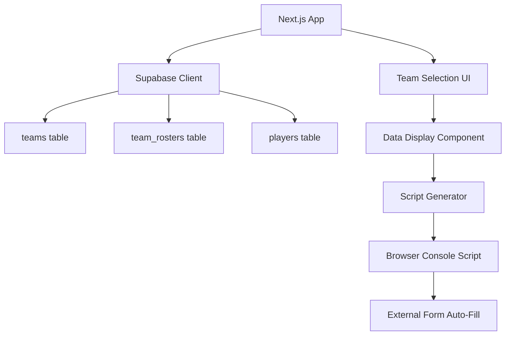

# League Registration Form Auto-Filler App

## Overview

A Next.js web application that retrieves team data (rosters and team info) from Supabase and generates browser console scripts to auto-fill external league registration forms.

## Architecture



## Implementation Plan

### 1. Project Setup

- Initialize Next.js project with TypeScript
- Install Supabase client library (`@supabase/supabase-js`)
- Set up environment variables for Supabase connection
- Configure project structure

### 2. Supabase Integration

- Create Supabase client configuration
- Set up TypeScript types from Supabase schema
- Create data fetching functions:
  - `getTeams()` - Fetch all teams with basic info
  - `getTeamRoster(teamId)` - Fetch team roster with player details
  - `getTeamInfo(teamId)` - Fetch complete team information

### 3. Core Components

#### Team Selection Page (`/`)

- Team list/dropdown component
- Display teams from `teams` table
- Show team name, logo, current RP, etc.

#### Team Data Display (`/team/[id]`)

- Display selected team information:
  - Team name, logo, colors
  - Current roster with player details (from `team_rosters` joined with `players`)
  - Player positions, gamertags, etc.
- Generate script button

#### Script Generator Component

- Analyzes form structure (field detection patterns)
- Maps Supabase data to form fields:
  - Team name → team name field
  - Player gamertags → player name fields
  - Player positions → position fields
  - Team colors → color fields
- Generates JavaScript code that:
  - Detects form fields by common patterns (name, id, label)
  - Fills fields with team data
  - Handles multiple players (roster expansion)
  - Provides visual feedback

### 4. Form Field Detection Patterns

The generated script will detect fields using:

- Common field names: `teamName`, `team_name`, `team-name`, `teamName[]`
- Player fields: `player1`, `player_1`, `playerName[]`, `roster[]`
- Position fields: `position`, `pos`, `playerPosition[]`
- Label-based detection: searches for labels containing "team", "player", "roster"

### 5. Features

- **Team Selection**: Browse and select teams from database
- **Roster Display**: View current team roster with player details
- **Script Generation**: Generate auto-fill script for selected team
- **Copy to Clipboard**: One-click copy of generated script
- **Field Mapping Preview**: Show which fields will be filled
- **Multi-Player Support**: Handle rosters with multiple players
- **Error Handling**: Graceful handling of missing data

### 6. File Structure

```
app/
├── page.tsx                 # Main team selection page
├── team/
│   └── [id]/
│       └── page.tsx         # Team detail and script generation
├── components/
│   ├── TeamSelector.tsx    # Team selection component
│   ├── TeamInfo.tsx        # Team information display
│   ├── RosterDisplay.tsx   # Roster list component
│   ├── ScriptGenerator.tsx # Script generation component
│   └── ScriptOutput.tsx    # Script display with copy button
├── lib/
│   ├── supabase.ts         # Supabase client setup
│   ├── queries.ts          # Data fetching functions
│   └── script-generator.ts  # Script generation logic
└── types/
    └── database.ts         # TypeScript types from Supabase
```

### 7. Script Generation Logic

The generated script will:

1. Detect form fields using multiple strategies
2. Map team data to detected fields
3. Fill fields programmatically
4. Handle dynamic roster fields (add rows if needed)
5. Provide console feedback on success/failure

### 8. UI/UX Considerations

- Clean, modern interface
- Clear instructions for using generated scripts
- Visual indicators for script generation status
- Responsive design
- Loading states for data fetching
- Error messages for failed operations

## Technical Details

### Supabase Queries

- Join `teams` with `team_rosters` and `players` tables
- Filter by active teams and current season (if applicable)
- Include player positions, gamertags, and other relevant data

### Script Output Format

The generated script will be a self-contained JavaScript snippet that users can paste into browser console on the registration form page.

## Dependencies

- `next` - Next.js framework
- `@supabase/supabase-js` - Supabase client
- `react` - React library
- TypeScript for type safety